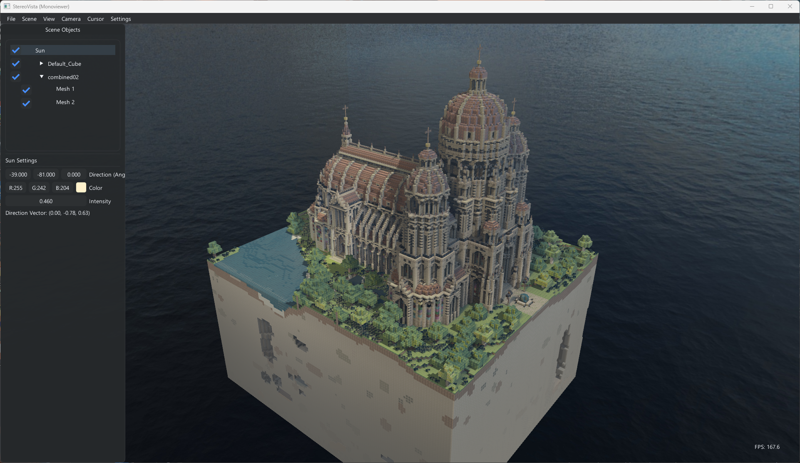
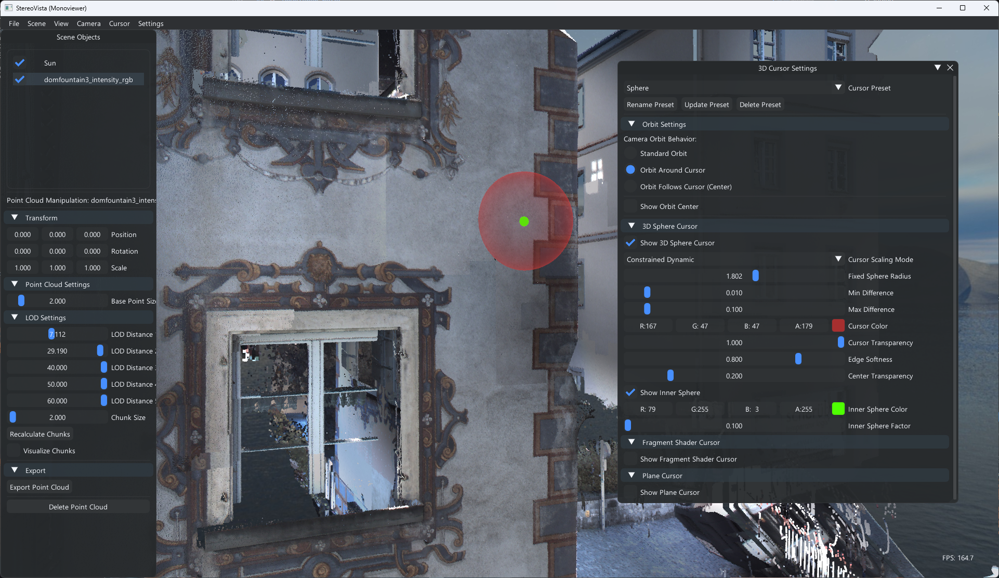
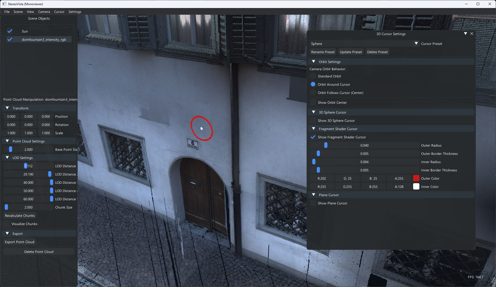
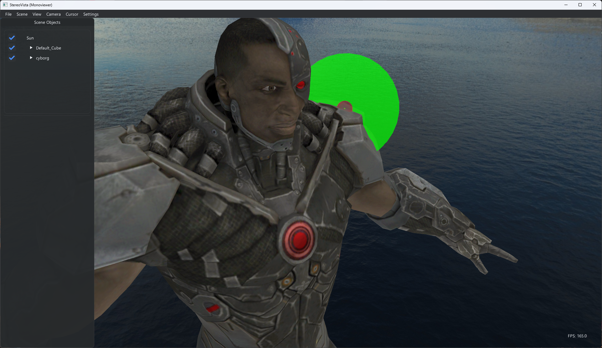
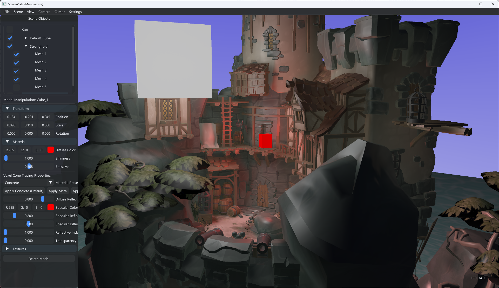
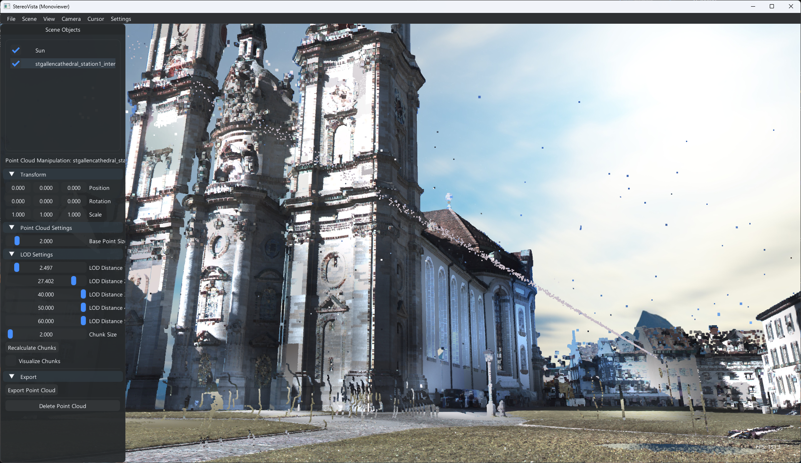
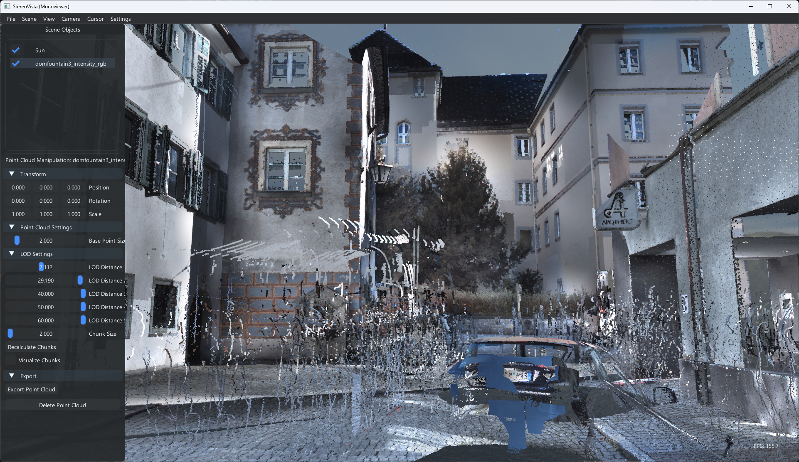

# StereoVista – Advanced Stereo 3D Viewer



StereoVista is a **Vulkan 1.3** application for interactive visualization and
manipulation of 3D models and point clouds, with native stereo output and a range
of stereo-display and navigation features. It combines a modern GPU renderer with
an ImGui interface and extensive customization.

> ### ⚙️ Status: Vulkan rewrite in progress (`StereoVista-vulkan`)
> This branch is a ground-up **OpenGL → Vulkan** port. What ships today: the
> multiview stereo renderer (quad-buffer / side-by-side / mono + OpenXR), forward
> **PBR + shadow mapping**, the compute point-cloud pipeline, the 3D cursors,
> transform gizmo, measurement & clip-plane tools, and the plugin system.
> **Deferred and being re-added natively:** the advanced global-illumination modes
> (Voxel Cone Tracing, DDGI, BVH Radiance), Bloom/SSAO post-FX, the full settings
> GUI, scene save/load, preferences persistence, and 3DConnexion SpaceMouse — these
> currently live only on the OpenGL `main` branch. See
> `docs/TODO.md` for the roadmap.

---

## Table of Contents
1. [Key Features](#key-features)
2. [Controls & Interaction](#controls--interaction)
3. [Getting Started](#getting-started)
4. [Project Structure](#project-structure)
5. [Developer Guide](#developer-guide)

---

## Key Features

### 👓 Native Stereo Rendering
* **Single-pass multiview** stereo (`VK_KHR_multiview`) — both eyes drawn together,
  not twice per frame:
  * **Quad-buffer 3D** — native stereo present to a 3D display via a 2-layer
    swapchain (workstation GPUs); auto-falls back to side-by-side elsewhere
  * **Side-by-side** — two half-width eye images on any display (preview)
  * **Mono** — single view
* **OpenXR HMD** output (bound to the app's Vulkan device via `XR_KHR_vulkan_enable2`)
  as a live toggle — a desktop run never contacts a VR runtime until you enable it
* Off-axis (parallel-axis) eye matrices with configurable **Separation** &
  **Convergence**, **Flip eyes**, and depth-driven **auto-convergence**

### 🎥 Advanced Camera System
* Quaternion camera: **orbit** (LMB), **pan** (MMB), **free-look** (RMB), **fly**
  (WASD + Q/E), Shift for fast
* *Zoom-to-cursor* and *orbit-around-cursor* using the depth-picked 3D cursor position
* Smooth motion; speed scales with scene/scale distance

### 🖱️ 3D Cursor Technology
| Type | Screenshot | Features |
|------|------------|----------|
| **Sphere Cursor** |  | Lit 3D sphere that sits on the surface under the mouse, distance-scaled, depth-occluded |
| **Fragment Cursor** |  | Ring drawn *onto* the surface by the mesh shader, with customizable radii/border |
| **Plane Cursor** |  | Flat disc that follows the surface — visualizes the tangent plane at the cursor |

The cursor position is reconstructed from an **asynchronous scene-depth readback**
(no pipeline stall), and all cursors + tools draw through one unified overlay renderer.

### 🏗️ Mesh Rendering

* Numerous formats via Assimp (OBJ, FBX, GLTF, 3DS, …)
* One **metallic-roughness PBR** path (Cook-Torrance) with **bindless** textures
  (albedo / metallic-roughness / normal / AO)
* **Transform gizmo** (translate / rotate / scale, world or local, snapping) with
  full undo/redo; model + sub-mesh selection

### 🌳 Point Cloud Visualization


* Formats: XYZ/TXT, ASCII & binary PLY, LAS/LAZ, HDF5, and native PCB
* **Compute software rasterizer** (Schütz `atomicMin` depth) — fast for dense,
  pixel-sized points — with optional **High-Quality Shading (HQS)** and adaptive splats
* **Progressive streaming** of large LAS/LAZ via a persistently-mapped upload ring;
  depth-correct compositing against meshes; real section/clip planes; renders in stereo

### 💡 Lighting & Shadows
* **Shadow Mapping** (shipping): directional sun (4K texel-snapped map) + point-light
  **depth cube maps** (rendered via multiview), normal-offset + slope-scaled bias,
  PCF/PCSS soft shadows
* **Skybox & environment**: cubemap, equirect HDR, solid, gradient
* **Planned (deferred in the Vulkan port — screenshots from the OpenGL build):**
  Voxel Cone Tracing, DDGI, and BVH ray-traced Radiance, plus Bloom/SSAO — to be
  re-implemented natively via `VK_KHR_ray_query` / compute (see the migration status doc)

### 🔧 Tools & Additional Features
* **Measurement tool** — distance / angle / area / point, x-ray ghosting, world-space
  labels, CSV export
* **Clip / section planes** — slice meshes *and* point clouds, edited with the gizmo
* **Undo/Redo** (Ctrl+Z / Ctrl+Y) via a generic command stack
* **Plugin system** — add tools as compile-time plugins (see `docs/PLUGINS.md`);
  Crosshair (example) + Measurement ship
* **HDR + tonemap** (Reinhard / ACES / Uncharted2 / AgX / Khronos PBR Neutral),
  **PNG screenshots**

---

## Controls & Interaction

> The Vulkan build currently exposes settings through an in-app **debug panel**
> (the full settings GUI is part of the migration roadmap).

### Camera Navigation
| Input | Action |
|-------|--------|
| **Left Mouse** drag | Orbit (around the 3D cursor when *orbit-around-cursor* is on) |
| **Middle Mouse** drag | Pan parallel to the view plane |
| **Right Mouse** drag | Free-look (first-person) |
| **Mouse Wheel** | Zoom (toward the 3D cursor when *zoom-to-cursor* is on) |
| **W / A / S / D** | Fly forward / left / back / right |
| **Q / E** | Fly down / up |
| **Left Shift** | Move faster |

### Selection & Manipulation
| Input | Action |
|-------|--------|
| **Left click** (no drag) | Select the model under the cursor; click again → drill into the sub-mesh |
| **Esc** | Clear selection |
| **1 / 2 / 3** | Gizmo mode: translate / rotate / scale |
| **Shift** (while dragging a handle) | Snap to increments |
| **Ctrl + Z** | Undo · **Ctrl + Y / Ctrl + Shift + Z** — Redo |

### Tools
| Input | Action |
|-------|--------|
| **Left click** | Place a measurement point (when the Measure plugin is enabled) |
| **Enter** / **Right click** | Finish the current measurement |
| **Backspace** / **Delete** | Remove the last point / cancel |

---

## Getting Started

1. **Requirements**
   * Windows 10/11 with a **Vulkan 1.3-capable** GPU driver (modern NVIDIA or AMD)
   * Visual Studio 2022 (v143, C++17)
   * 4 GB+ RAM (more for large point clouds)
   * *(Optional)* Vulkan SDK for validation layers; an OpenXR runtime for VR

2. **Build**
   * Clone the repository (the Vulkan toolchain is vendored — no SDK install needed)
   * Open `StereoVista.sln` in Visual Studio, or build from the command line:
     ```
     MSBuild StereoVista.sln /p:Configuration=Release /p:Platform=x64 /m
     ```
   * Run `bin/x64/Release/StereoVista.exe` (an example `office.scene` loads by default)

3. **First Launch**
   * Use the debug panel to load models / point clouds, adjust lighting and stereo,
     and enable tools/plugins
   * Try the stereo modes and, with an HMD connected, the **Enable VR** toggle

---

## Project Structure

```
Stereo-Viewer-Project/
├── StereoVista/
│   ├── src/
│   │   ├── App/            # main.cpp (thin entry) + Application (loop, wiring, debug UI)
│   │   ├── Platform/       # Window (GLFW no-API + VkSurface), asset paths
│   │   ├── RHI/            # Vulkan RHI (Device, Swapchain, Buffer, Texture, Pipeline, …)
│   │   ├── Renderer/       # Renderer + passes/ (shadow, forward, skybox, pointcloud, overlay, tonemap)
│   │   ├── Scene/          # scene host, primitives, Assimp import, picking
│   │   ├── Cursors/ Tools/ Plugins/   # 3D cursors, gizmo/measure/clip tools, plugin system
│   │   ├── Core/           # Camera, UndoManager
│   │   ├── Loaders/        # point-cloud parsers + RHI upload
│   │   └── Engine/         # XRSession, Screenshot (+ excluded OpenGL reference)
│   ├── headers/            # Header files (mirrors src/), headers/libs/ = vendored deps
│   ├── assets/shaders_vk/  # Vulkan GLSL → SPIR-V
│   └── office.scene        # Example scene
├── dependencies/           # Pre-built third-party libraries + glslc
├── docs/                   # TODO.md, PLUGINS.md
├── skybox/  fonts/  screenshots/
└── README.md
```

---

## Developer Guide

### Architecture
StereoVista is layered so that **only the RHI touches Vulkan**; everything above
speaks in RHI handles:

* **Platform** – GLFW window (no GL context) + `VkSurfaceKHR`
* **RHI** – Device, Swapchain, Buffer/Texture, Pipeline (with SPIR-V reflection),
  descriptors, barriers, upload ring, shader compiler
* **Renderer** – a pass-based frame graph (shadow → forward → point cloud → skybox →
  tonemap → overlay → ImGui), multiview-native for stereo/XR
* **Systems** – Scene, Cursors, Tools, Plugins, Loaders, XRSession
* **App** – `Application` owns the main loop and wires everything together

See **`CLAUDE.md`** for conventions and **`docs/TODO.md`** for the roadmap
(remaining ports, known bugs, optimization). The migration's design rationale
and session history live in git.

### Extending the Application
* **New tool / overlay:** add a compile-time plugin — one header + one `.cpp` +
  `REGISTER_PLUGIN`, then list both in the `.vcxproj`(+`.filters`). Full guide:
  **`docs/PLUGINS.md`**.
* **New rendering feature:** add a pass object under `Renderer/passes/` and sequence
  it in `Renderer::recordFrame`; author shaders in `assets/shaders_vk/` (they compile
  to SPIR-V via the project's custom build step). Keep Vulkan out of the layers above
  the RHI.

There is no automated test suite — verification is manual/visual (Windows/MSVC).
